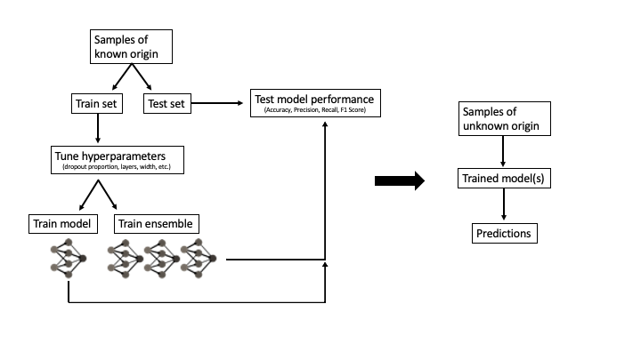
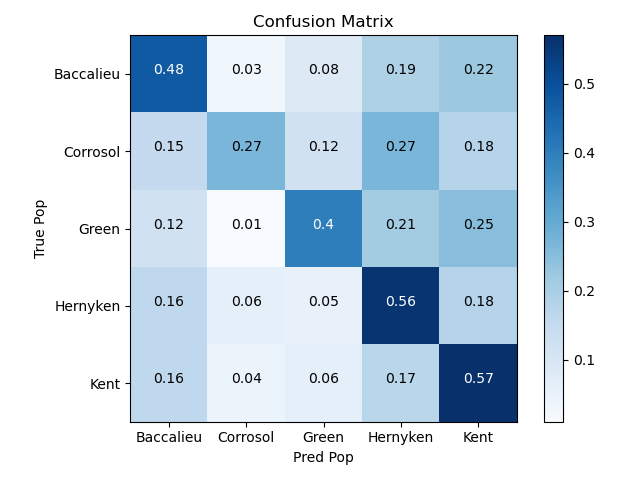
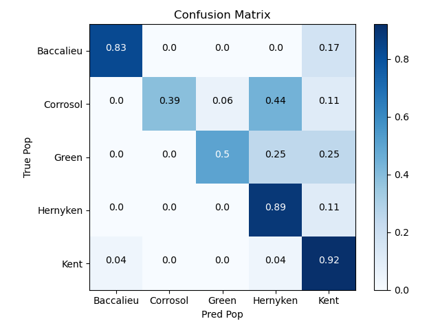
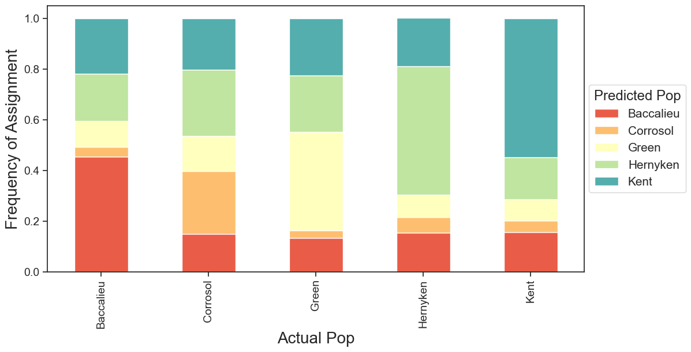
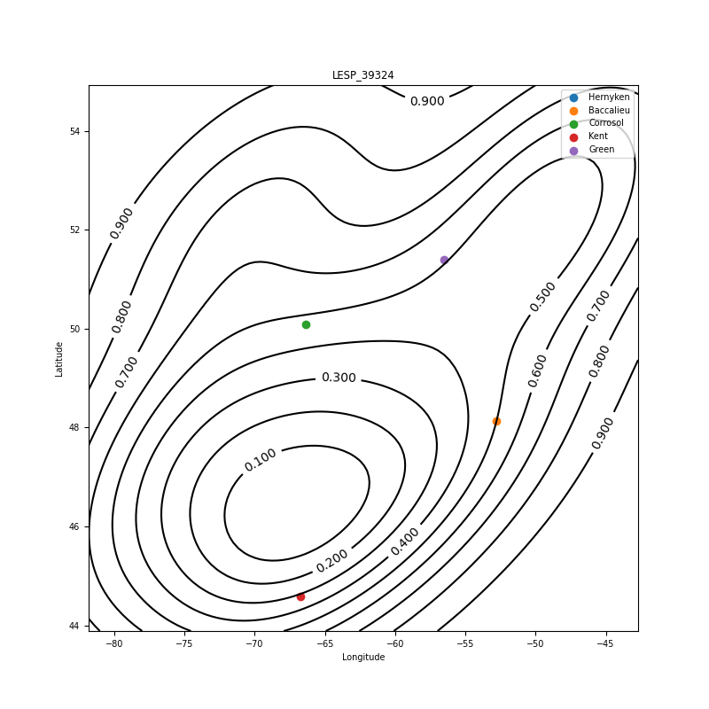
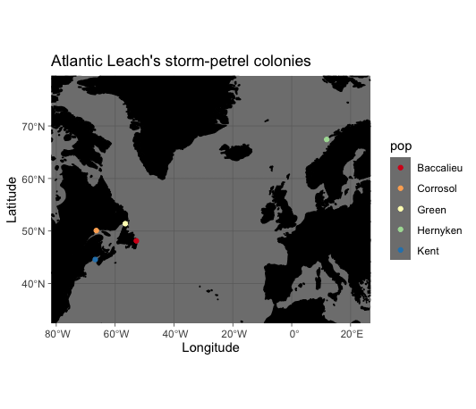

# pop_finder 

 [](https://codecov.io/gh/katieb1/pop_finder)  [](https://pop_finder.readthedocs.io/en/latest/?badge=latest)

Python package that uses neural networks for population assignment

## Table of Contents
[General Schematic](#general-schematic)

[Installation](#installation)

[Features](#features)

[Dependencies](#dependencies)

[Usage](#usage)

* [Python IDE](#python-IDE)

* [Command Line](#command-line)

[Documentation](#documentation)

[Contributors](#contributors)


## General Schematic



## Installation

```bash
$ pip install pop-finder
```

## Features

This package includes two main modules, `pop_finder` and `contour_classifier`, that use genetic data to assign individuals of unknown origin to source populations. Each of these modules have a K-Fold Cross-Validation function for estimating the uncertainty of model predictions. The `pop_finder` module also has a `hyper_tune` option, which allows you to tune the hyperparameters of the neural network before getting an accuracy estimate and predicting on unknowns.

### Module 1: `pop_finder`

1. `pop_finder.pop_finder.run_neural_net()`: runs a classification neural network for population assignment. 

    Outputs:

    * `metrics.csv`: statistics relating to the model accuracy / precision / recall / F1 score.
    
    Outputs if ensemble=True:

    * `pop_assign_freqs.csv`: the number of times an individual was assigned to each population across the entire ensemble of models.

    * `pop_assign_ensemble.csv`: the top population of assignment for each individual of unknown origin, along with the frequency of assignment to that population across the entire ensemble of models.

    * `ensemble_test_results.csv`: proportion of times an individual in the test set was assigned to each population across the entire ensemble of models. Used for assessing accuracy.

    Outputs if ensemble=False:

    * `pop_assign.csv`: populations assignments for individuals of unknown origin.  

    * `test_results.csv`: prediction values for each individual from the test set.

2. `pop_finder.pop_finder.hyper_tune()`: tunes the model hyperparameters for a given dataset to maximize accuracy and minimize loss.

    Outputs:

    * `best_mod`: the `save_dir` from running this function can later be used as the `mod_path` when running `run_neural_net` or `kfcv`, allowing you to use a model with tuned hyperparameters rather than the default model.

3. `pop_finder.pop_finder.kfcv()`: runs K-Fold Cross-Validation on model(s) and outputs metrics of model performance (accuracy, precision, recall, F1 score) and confusion matrix plots.

    Outputs:

    * `classification_report.csv`: scikit-learn's classification report containing information on accuracy, precision, recall, and F1 score for each population and the overall model.

    * `cm.png`: confusion matrix for single model predictions. If an ensemble is used, this is each individual model's predictions summed rather than the performance of the ensemble.

    

    * `metrics.csv`: includes accuracy scores for the test set using single models, using the ensemble model, and using a weighted ensemble model. Also includes the 95% confidence interval and loss of the test values using the single model(s).

    Outputs if ensemble=True:

    * `ensemble_classification_report.csv`: classification report for the ensemble of models. Can be used to compare model performance between using an ensemble vs using a single model.

    

    * `ensemble_cm.png`: confusion matrix for ensemble model predictions.

    * `ensemble_test_results.csv`: proportion of times an individual in the test set was assigned to each population across the entire ensemble of models. Used for assessing accuracy.

    * `ensemble_preds.csv`: predictions across all models used in the ensemble.

4. `pop_finder.pop_finder.snp_rank()`: finds relative importance of SNPs on accuracy of model. Can be used to create SNP chips for future population assignment tasks.

    Output:

    * `perturbation_rank_results.csv`: table of SNPs and corresponding relative importance. SNP ID relates to the order in which the SNP was found in the VCF file.

5. `pop_finder.pop_finder.assign_plot()`: can be run with the output from `run_neural_net` to create a structure plot of model confidence in predictions for each population. This function uses the model prediction values for each sample, so takes into account how confident the model was in each prediction rather than if the model predicted correctly vs incorrectly.

    Output:

    * `assign_plot.png`


6. `pop_finder.pop_finder.structure_plot()`: can be run with the output from `kfcv` to create a structure plot of correct assignment of test sets to see general accuracy of model predictions. This function only uses whether the model predicted correctly vs. incorrectly, and thus does not indicate true model confidence.

    Output:

    * `structure_plot.png`

    

### Module 2: `contour_classifier`

1. `pop_finder.contour_classifier.contour_classifier()`: runs a regression neural network many times, then uses the combined output to create contour plots for population assignment.

    Outputs:

    * `results.csv`: table with containing predicted locations of unknown samples, as well as the contour line the population for each sample was found in.

    * contour plots: `*.png` files of the contour plots for each sample of unknown origin.

    

2. `pop_finder.contour_classifier.kfcv()`: runs K-Fold Cross-Validation on the regression neural network + contour function for the given data.

    Outputs:

    * `classification_report.csv`: scikit-learn's classification report containing information on accuracy, precision, recall, and F1 score for each population and the overall model.

    * `cm.png`: confusion matrix comparing true and predicted labels.

**Package Data**: A small set of data including example VCF, HDF5, and tab-delimited input files are included for testing the functions. Some usage examples with this data are included below.

The genetic data corresponds to Atlantic Leach's storm-petrels (*Hydrobates* spp.) from the following colonies:



## Dependencies

The following `python` packages are required to run `pop_finder`:

* python = ">=3.7.1, <3.10"
* numpy = "1.19.5"
* pandas = "^1.2.3"
* h5py = "2.10.0"
* sklearn = "^0.0"
* keras-tuner = "1.0.2"
* matplotlib = "3.3.2"
* zarr = "^2.6.1"
* seaborn = "^0.11.1"
* wheel = "^0.36.2"
* scikit-allel = "1.3.3"
* scipy = ">=1.6.0, <2.0.0"
* tqdm = "^4.59.0"
* tensorflow-cpu = "2.4.1"

## Usage

### Python IDE

Load the packages from the `pop_finder` library:

```
# Module 1 packages
from pop_finder.pop_finder import hyper_tune
from pop_finder.pop_finder import kfcv as mod1_kfcv
from pop_finder.pop_finder import structure_plot
from pop_finder.pop_finder import run_neural_net
from pop_finder.pop_finder import assign_plot
from pop_finder.pop_finder import snp_rank

# Module 2 packages
from pop_finder.contour_classifier import contour_classifier
from pop_finder.contour_classifier import kfcv as mod2_kfcv
```

Run the modules on the sample data found in [this folder](https://github.com/katieb1/pop_finder/tree/main/tests/test_inputs).

**Module 1**

*Step 1*: Set paths to helper data and output directories

* `infile_all` contains genetic information for all samples, including ones of unknown origin
* `sample_data` is the tab-delimited input file with columns sampleID, x, y, and pop
* `mod_path` will be the path to the model with tuned hyperparameters
* `kfcv_save_path` will be where all the outputs are stored from K-fold cross-validation
* `nn_save_path` will be where all the outputs are stored from running the neural network to generate predictions

```
# Paths to helper data
infile_all = "tests/test_inputs/onlyAtl_500.recode.vcf.locator.hdf5"
sample_data = "tests/test_inputs/onlyAtl_truelocs_NAs.txt" 

# Path to module 1 output
mod_path = "tuned_model"
kfcv_save_path = "mod1_kfcv_out"
nn_save_path = "mod1_nn_out"
```

*Step 2*: tune model hyperparameters using `hyper_tune` function
```
hyper_tune(    
    infile=infile_all,
    sample_data=sample_data,
    max_trials=10,
    runs_per_trial=10,
    max_epochs=100,
    train_prop=0.8,
    seed=None,
    save_dir=mod_path,
    )
```

*Step 3*: run K-Fold cross-validation on the data + tuned model
```
mod1_kfcv(
    infile=infile_all,
    sample_data=sample_data,
    mod_path=mod_path,
    n_splits=5,
    n_reps=5,
    ensemble=False,
    save_dir=kfcv_save_path,
    return_plot=True,
    save_allele_counts=False,
    # Below are all keyword arguments for running neural network
    # For options, see documentation on pop_finder function
    patience=100,
    batch_size=32,
    max_epochs=100
)

# Create structure plot by pointing function to results folder
structure_plot(
    save_dir=kfcv_save_path,
    ensemble=False,
)

# Check output folder for confusion matrix plot and model performance metrics
```

*Step 4*: run neural network to get predictions
```
run_neural_net(
    infile=infile_all,
    sample_data=sample_data,
    save_allele_counts=False,
    mod_path=mod_path,
    train_prop=0.8,
    seed=2,
    # Keyword arguments below here
    # See documentation for options
    ensemble=False,
    try_stacking=False,
    predict=True,
    save_dir=nn_save_path,
    save_weights=False,
    patience=100,
    batch_size=32,
    max_epochs=100,
    plot_history=True
    )

# Generate assignment plot of model confidence for each population
# Point assign_plot function to results folder from nn run
assign_plot(
    save_dir=nn_save_path,
    ensemble=False
)

# For table of predictions and model performance metrics,
# see output folder
```

*Step 6*: Find relative importance of each SNP in model performance
```
snp_rank(
    infile=infile_all,
    sample_data=sample_data,
    mod_path=mod_path,
    save_dir=nn_save_path
)

# Check output for ranking results
```

**Module 2**

*Step 1*: Set paths to helper data and output directories

* `infile_all` contains genetic information for all samples, including ones of unknown origin
* `infile_kfcv` contains genetic information for only samples of known origin (this is only needed for the `contour_classifier` function)
* `sample_data` is the tab-delimited input file with columns sampleID, x, y, and pop
* `kfcv_save_path` will be where all the outputs are stored from K-fold cross-validation
* `nn_save_path` will be where all the outputs are stored from running the neural network to generate predictions

```
# Paths to helper data
infile_all_vcf = "tests/test_inputs/onlyAtl_500.recode.vcf"
infile_kfcv = "tests/test_inputs/onlyAtl_500_kfcv.recode.vcf"
sample_data = "tests/test_inputs/onlyAtl_truelocs_NAs.txt" 

# Path to module 1 output
kfcv_save_path = "mod2_kfcv_out"
nn_save_path = "mod2_nn_out"
```

*Step 2*: Run K-Fold Cross-Validation on data
```
mod2_kfcv(
    sample_data=sample_data,
    gen_dat=infile_kfcv,
    n_splits=5,
    n_runs=5,
    return_plot=True,
    save_dir=kfcv_save_path,
    # Keyword arguments below, see documentation on 
    # locator_mod and contour_classifier for options
    num_contours=15,
    nboots=20,
    batch_size=32,
    max_epochs=100,
    patience=100
    min_mac=2,
    impute_missing=True,
    plot_history=True,
    keep_weights=False,
)

# See output folder for model performance and 
# confusion matrix plot
```

*Step 3*: run neural network + contour function for population assignment of samples of unknown origin
```
contour_classifier(
    sample_data=sample_data,
    num_contours=15,
    run_locator=True,
    gen_dat=infile_all_vcf,
    nboots=20,
    return_plots=True,
    return_df=True,
    save_dir=nn_save_path,
    multi_iter=5,
    # Key word arguments below
    train_split=0.8,
    batch_size=32,
    max_epochs=100,
    patience=100,
    min_mac=2,
    impute_missing=True,
    plot_history=True,
    keep_weights=False,
)

# Check output folder for contour plots and results table
```

### Command Line

In addition to running within a Python IDE, you can also run `pop_finder` and `contour_classifier` on the command line!

General guidelines:

* The first two values MUST be the paths to the genetic data file (`infile`) followed by the sample data file (`sample_data`)
* You can also set all the same arguments as above using flags followed by a value
* Boolean values will be their default values unless specified by a flag (e.g. the `ensemble` parameter is `False` by default and will remain so if left out of the command line argument, but adding the `--ensemble` flag with no value following will set this value to `True`)

**Module 1**

The command line function for Module 1 is called `cli_classifier`.

*Step 1*: Run model hyperparameter tuner using the `--hyper_tune` flag

```
cli_classifier tests/test_inputs/onlyAtl_500.recode.vcf.locator.hdf5 \
    tests/test_inputs/onlyAtl_truelocs_NAs.txt --hyper_tune \
    --max_trials 10 --runs_per_trial 10 --max_epochs 100 \
    --train_prop 0.8 --save_dir tuned_model
```

*Step 2*: Run K-Fold Cross-Validation using the `--kfcv` flag

* A structure plot is automatically generated and added to the output directory with the command line function
```
cli_classifier tests/test_inputs/onlyAtl_500.recode.vcf.locator.hdf5 \
    tests/test_inputs/onlyAtl_truelocs_NAs.txt --kfcv \
    --mod_path tuned_model --n_splits 5 --n_reps 5 \
    --save_dir mod1_kfcv_out --patience 100 --batch_size 32 \
    --max_epochs 100
```

*Step 3*: Run classification neural network with the `--run_neural_net flag`

* An assign plot is automatically generated and added to the output directory with the command line function
```
cli_classifier tests/test_inputs/onlyAtl_500.recode.vcf.locator.hdf5 \
    tests/test_inputs/onlyAtl_truelocs_NAs.txt --run_neural_net \
    --mod_path tuned_model --train_prop 0.8 --seed 2 --predict \
    --save_dir mod1_nn_out --patience 100 --batch_size 32 \
    --max_epochs 100 --plot_history
```

*Step 4*: Run snp_rank function with the `--snp_rank flag`
```
cli_classifier tests/test_inputs/onlyAtl_500.recode.vcf.locator.hdf5 \
    tests/test_inputs/onlyAtl_truelocs_NAs.txt --mod_path tuned_model \
    save_dir mod1_nn_out
```

**Module 2**

The command line function for Module 1 is called `cli_regressor`.

* The path to the sample data file (`sample_data`) is a non-optional argument and must be first in the command line function

*Step 1*: run K-Fold Cross-Validation by setting the `--kfcv` flag
```
cli_regressor tests/test_inputs/onlyAtl_truelocs_NAs.txt \
    --gen_dat tests/test_inputs/onlyAtl_500.recode.vcf \
    --kfcv --n_splits 5 --n_runs 5 --return_plot \
    --save_dir mod2_kfcv_out --num_contours 15 --nboots 20 \
    --batch_size 32 --max_epochs 100 --patience 100 --min_mac 2 \
    --impute_missing --plot_history
```

*Step 2*: run neural networks and contour classifier by setting the `--contour_classifier` flag
```
cli_regressor tests/test_inputs/onlyAtl_truelocs_NAs.txt \
    --gen_dat tests/test_inputs/onlyAtl_500.recode.vcf \
    --contour_classifier --num_contours 15 --run_locator \
    --nboots 20 --save_dir mod2_nn_out --multi_iter 3 \
    --train_split 0.8 --batch_size 32 --max_epochs 100 \
    --patience 100 --min_mac 2 --impute_missing --plot_history
```

## Documentation

The official documentation is hosted on Read the Docs: https://pop_finder.readthedocs.io/en/latest/

## Contributors

We welcome and recognize all contributions. You can see a list of current contributors in the [contributors tab](https://github.com/katieb1/pop_finder/graphs/contributors).

### Credits

This package was created with Cookiecutter and the UBC-MDS/cookiecutter-ubc-mds project template, modified from the [pyOpenSci/cookiecutter-pyopensci](https://github.com/pyOpenSci/cookiecutter-pyopensci) project template and the [audreyr/cookiecutter-pypackage](https://github.com/audreyr/cookiecutter-pypackage).

The original `locator` code for this package was created by [Battey et al. 2020](https://elifesciences.org/articles/54507) and can be found in this [GitHub repository](https://github.com/kr-colab/locator).
