# pop_finder 

 [](https://codecov.io/gh/katieb1/pop_finder)  [](https://pop_finder.readthedocs.io/en/latest/?badge=latest)

Python package that uses neural networks for population assignment

## Table of Contents
[General Schematic](#general-schematic)

[Installation](#installation)

[Features](#features)

[Dependencies](#dependencies)

[Usage](#usage)

* [Python IDE](#python-IDE)

* [Command Line](#command-line)

[Documentation](#documentation)

[Contributors](#contributors)


## General Schematic


## Installation

Install from PyPI (easiest installation method)
```bash
$ pip install -u pop-finder
```

Install from sources
* Clone public repository
```
git clone git://github.com/katieb1/pop_finder
```

* Or download tarball
```
curl  -OL https://github.com/katieb1/pop_finder/tarball/main
```

`pop_finder` can be then be installed using either `setuptools` or `poetry`

* `setuptools` method
```
python setup.py install
```

* `poetry` method (make sure you have the latest version of `poetry` installed)
```
# if you have not installed poetry, run the following
pip install -u poetry

# then install
poetry install
```

## Features

This package includes two main modules, `pop_finder` and `contour_classifier`, that use genetic data to assign individuals of unknown origin to source populations. Each of these modules have a K-Fold Cross-Validation function for estimating the uncertainty of model predictions. The `pop_finder` module also has a `hyper_tune` option, which allows you to tune the hyperparameters of the neural network before getting an accuracy estimate and predicting on unknowns.

### Module 1: `pop_finder`

1. `pop_finder.pop_finder.run_neural_net()`: runs a classification neural network for population assignment. 

2. `pop_finder.pop_finder.hyper_tune()`: tunes the model hyperparameters for a given dataset to maximize accuracy and minimize loss.

3. `pop_finder.pop_finder.kfcv()`: runs K-Fold Cross-Validation on model(s) and outputs metrics of model performance (accuracy, precision, recall, F1 score) and confusion matrix plots.

4. `pop_finder.pop_finder.snp_rank()`: finds relative importance of SNPs on accuracy of model. Can be used to create SNP chips for future population assignment tasks.

5. `pop_finder.pop_finder.assign_plot()`: can be run with the output from `run_neural_net` to create a structure plot of model confidence in predictions for each population. This function uses the model prediction values for each sample, so takes into account how confident the model was in each prediction rather than if the model predicted correctly vs incorrectly.

6. `pop_finder.pop_finder.structure_plot()`: can be run with the output from `kfcv` to create a structure plot of correct assignment of test sets to see general accuracy of model predictions. This function only uses whether the model predicted correctly vs. incorrectly, and thus does not indicate true model confidence.


### Module 2: `contour_classifier`

1. `pop_finder.contour_classifier.contour_classifier()`: runs a regression neural network many times, then uses the combined output to create contour plots for population assignment.

2. `pop_finder.contour_classifier.kfcv()`: runs K-Fold Cross-Validation on the regression neural network + contour function for the given data.

**Package Data**: A small set of data including example VCF, HDF5, and tab-delimited input files are included for testing the functions. Some usage examples with this data are included below.

The genetic data corresponds to Atlantic Leach's storm-petrels (*Hydrobates* spp.) from the following colonies:


## Dependencies

The following `python` packages are required to run `pop_finder`:

* python = ">=3.7.1, <3.10"
* numpy = "1.19.5"
* pandas = "1.1.5"
* h5py = "2.10.0"
* keras-tuner = "1.0.2"
* matplotlib = "3.3.2"
* zarr = "^2.6.1"
* seaborn = "^0.11.1"
* wheel = "^0.36.2"
* scikit-allel = "1.3.0"
* scikit-learn = "0.23"
* scipy = ">=1.6.0, <2.0.0"
* tqdm = "^4.59.0"
* tensorflow-cpu = "2.4.1"

## Usage

### Python IDE

Run the modules on the sample data found in [this folder](https://github.com/katieb1/pop_finder/tree/main/tests/test_inputs).

**Module 1**

*Step 1*: Load packages and set paths to helper data and output directories

```
# Module 1 packages
from pop_finder.pop_finder import hyper_tune
from pop_finder.pop_finder import kfcv as mod1_kfcv
from pop_finder.pop_finder import structure_plot
from pop_finder.pop_finder import run_neural_net
from pop_finder.pop_finder import assign_plot
from pop_finder.pop_finder import snp_rank
```

* `infile_all` contains genetic information for all samples, including ones of unknown origin
* `sample_data` is the tab-delimited input file with columns sampleID, x, y, and pop
* `mod_path` will be the path to the model with tuned hyperparameters
* `kfcv_save_path` will be where all the outputs are stored from K-fold cross-validation
* `nn_save_path` will be where all the outputs are stored from running the neural network to generate predictions

```
# Paths to helper data
infile_all = "tests/test_inputs/onlyAtl_500.recode.vcf.locator.hdf5"
sample_data = "tests/test_inputs/onlyAtl_truelocs_NAs.txt" 

# Path to module 1 output
mod_path = "tuned_model"
kfcv_save_path = "mod1_kfcv_out"
nn_save_path = "mod1_nn_out"
```

*Step 2*: tune model hyperparameters using `hyper_tune` function
```
hyper_tune(    
    infile=infile_all,
    sample_data=sample_data,
    max_trials=10,
    runs_per_trial=10,
    max_epochs=100,
    train_prop=0.8,
    seed=None,
    save_dir=mod_path,
    )
```

This will create an output directory (`mod_path`) that contains a tuned model, in which the combination of hyperparameters results in the best model performance for the given data. Hyperparameters are values that affect how the model learns, such as the number of nodes per layer in a neural network or the size of the steps a model takes to reach a prediction. There are no general intuitive values for these hyperparameters, as the values that result in the best model depend on the data itself. Therefore, running a model with tuned hyperparameters for the specific dataset being used usually yields significantly better model performance compared to a default model.

If you would like to take a look at the resulting model structure of the tuned model, you can run the following code:
```
import tensorflow.keras as tfk

model = tfk.models.load_model("mod_path/best_mod")
model.summary()
```

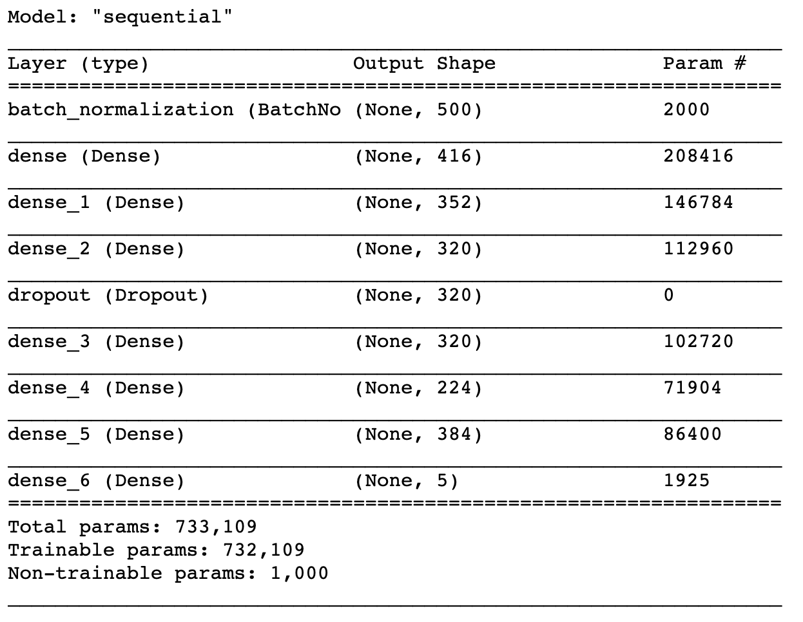

*Step 3*: run K-Fold cross-validation to assess model performance of the tuned model

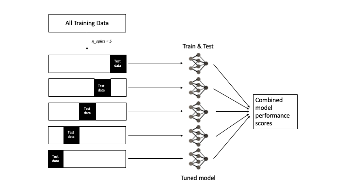

K-Fold cross-validation splits the training data into K folds, then trains the model using K-1 folds and tests the model on the hold-out fold. This is repeated K times, so that each fold is used once to test the model performance. The results of each run are combined, providing a more accurate assessment of model performance than if a single training set were used, especially for small datasets. 
```
mod1_kfcv(
    infile=infile_all,
    sample_data=sample_data,
    mod_path=mod_path,
    n_splits=5,
    n_reps=5,
    ensemble=False,
    save_dir=kfcv_save_path,
    return_plot=True,
    save_allele_counts=False,
    # Below are all keyword arguments for running neural network
    # For options, see documentation on pop_finder function
    patience=100,
    batch_size=32,
    max_epochs=100
)

# Check output folder for confusion matrix plot and model performance metrics
```

This function outputs a confusion matrix, displaying the proportion of correct versus incorrect assignments, and a table of model performance metrics.


The confusion matrix has the true population of origin along the Y-axis and the predicted population of origin along the X-axis, with the colour representing the proportion of individuals assigned. A good model will have higher proportions (darker colours) along the diagonal, meaning that the model is correctly predicting an individual as being from its true population of origin most of the time. Checking the confusion matrix is a good way of determining the false positive rate (individuals being assigned to a population when they are not from that population) and false negative rate (individuals not being assigned to the population they are known to be from), in addition to accuracy per population. You can have high accuracy for a population in combination with a high false positive rate for that same population, i.e. all individuals being assigned to the same population, whether they are from that population or not. For instance, in the example above, Kent has 92% accuracy, but also a large proportion of individuals being assigned to Kent that are not actually from Kent. Thus, accuracy alone is not always the best metric for assessing model performance.

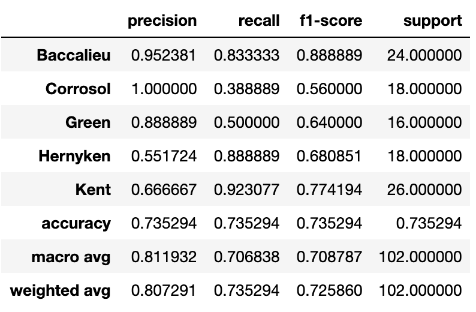

The metrics table returns information about precision, recall, f1-score, and accuracy. See below for definitions of these metrics:  

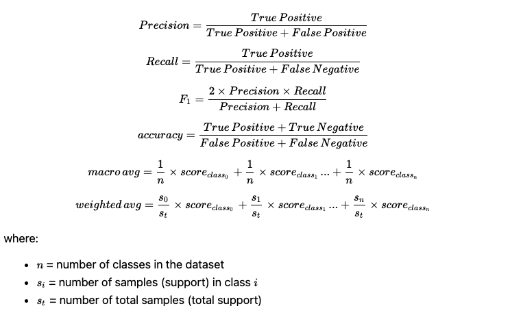

The support is the number of samples in each class, which can be increased by using multiple iterations of K-fold cross-validation and the ensemble method (implements bootstrap aggregating).

Finally, the results from K-fold cross-validation can be run through a `structure_plot` function in the `pop_finder` module as well. The structure plot displays the frequency of assignment to each predicted population for samples from each actual population.
```
# Create structure plot by pointing function to results folder
structure_plot(
    save_dir=kfcv_save_path,
    ensemble=False,
)
```


*Step 4*: run neural network to get predictions

The `run_neural_net` function uses all the training data to train the final tuned model, uses the hold-out test data to get a test accuracy score, and then uses the trained model to predict the population of unknown samples.
```
run_neural_net(
    infile=infile_all,
    sample_data=sample_data,
    save_allele_counts=False,
    mod_path=mod_path,
    train_prop=0.8,
    seed=2,
    # Keyword arguments below here
    # See documentation for options
    ensemble=False,
    try_stacking=False,
    save_dir=nn_save_path,
    save_weights=False,
    patience=100,
    batch_size=32,
    max_epochs=100,
    plot_history=True
    )

```

The outputs can be found in the `save_dir` specified in the function. Within this folder, you can find test results, model performance metrics, and population assignments for the unknown samples.

The **test results** (`test_results.csv` or `ensemble_test_results.csv`) show how well the model did when running on the hold-out test set. For each sample, there is a value of how confident the model was in its assignment for each population, the population with the highest confidence (AKA the prediction; `top_samp`), and the actual population of origin (`true_pops`).

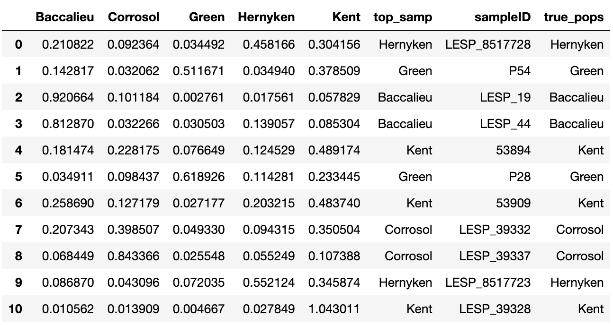

The output folder will also contain a `metrics.csv`, which includes information on model accuracy. If the ensemble method is run, then it will give both the test accuracy, which is an average accuracy across all models run individually (creates multiple predictions for each sample), as well as the ensemble accuracy, which is the accuracy of the ensemble of models (creates single prediction for each sample). *Note: the weighted ensemble accuracy is a feature that is not yet available, so feel free to ignore this metric.* 

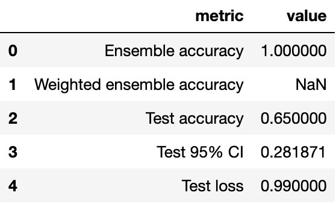

If running the model using the ensemble method (bootstrap aggregating), then two tables are output: (1) `pop_assign_ensemble.csv` containing the population assignments for each unknown sample and the proportion of models in the ensemble that resulted in this assignment;

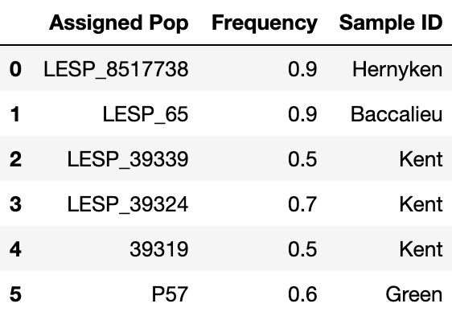

and (2) `pop_assign_freqs.csv` containing information on the proportion of models in the ensemble that assigned a sample to each population.

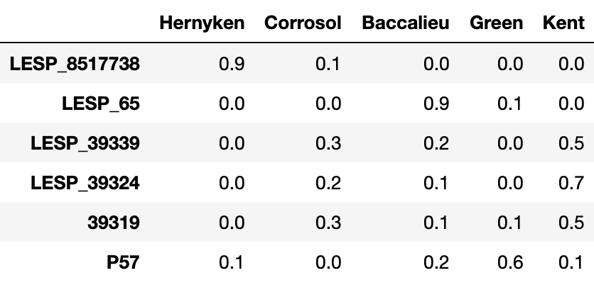

If the `plot_history` argument is set to `True`, then the function will also output a training history plot that compares the training loss to the validation loss. This plot is useful for determining whether the model is overfit or underfit, in which case you can adjust the number of epochs accordingly. If you are using the ensemble method, a training history plot is output for each model (equal to `nbags`).

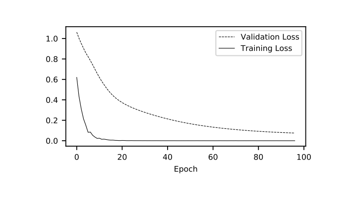

The results from `run_neural_net` can be plotted using the `assign_plot` function. This function plots the assignment of each unknown individual, taking into account the confidence of the model predictions. This assignment plot is useful for determining where the model is getting confused. For instance, in the plot below, the populations Kent and Corrosol often appear at high frequencies together, and therefore may share genetic markers that influence the model.
```
# Generate assignment plot of model confidence for each population
# Point assign_plot function to results folder from nn run
assign_plot(
    save_dir=nn_save_path,
    ensemble=False
)
```

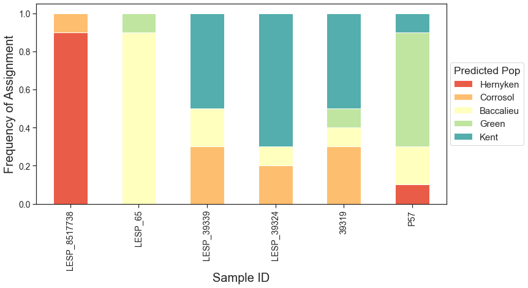

*Step 6*: Find relative importance of each SNP in model performance

The SNP rank function finds the contribution of each SNP to model performance and ranks the SNPs accordingly. It uses a perturbation function - for each SNP, the order of information is randomly rearranged across all individuals and the increase in error is measured from the baseline model.
```
snp_rank(
    infile=infile_all,
    sample_data=sample_data,
    mod_path=mod_path,
    save_dir=nn_save_path
)
```

In the `save_dir` folder, you will find a `perturbation_rank_results.csv` file containing the relative importance of each SNP. The value in the `snp` column refers to the order in which the SNP appears in the VCF file.

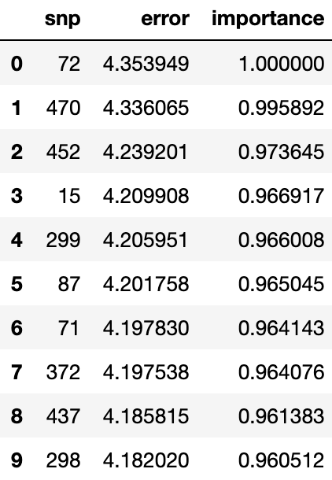

**Module 2**

*Step 1*: Load packages and set paths to helper data and output directories

```
# Module 2 packages
from pop_finder.contour_classifier import contour_classifier
from pop_finder.contour_classifier import kfcv as mod2_kfcv
```

* `infile_all` contains genetic information for all samples, including ones of unknown origin
* `infile_kfcv` contains genetic information for only samples of known origin (this is only needed for the `contour_classifier` function)
* `sample_data` is the tab-delimited input file with columns sampleID, x, y, and pop
* `kfcv_save_path` will be where all the outputs are stored from K-fold cross-validation
* `nn_save_path` will be where all the outputs are stored from running the neural network to generate predictions

```
# Paths to helper data
infile_all_vcf = "tests/test_inputs/onlyAtl_500.recode.vcf"
infile_kfcv = "tests/test_inputs/onlyAtl_500_kfcv.recode.vcf"
sample_data = "tests/test_inputs/onlyAtl_truelocs_NAs.txt" 

# Path to module 2 output
kfcv_save_path = "mod2_kfcv_out"
nn_save_path = "mod2_nn_out"
```

*Step 2*: Run K-Fold Cross-Validation on data
```
mod2_kfcv(
    sample_data=sample_data,
    gen_dat=infile_kfcv,
    n_splits=5,
    n_runs=5,
    return_plot=True,
    save_dir=kfcv_save_path,
    # Keyword arguments below, see documentation on 
    # locator_mod and contour_classifier for options
    num_contours=15,
    nboots=20,
    batch_size=32,
    max_epochs=100,
    patience=100,
    min_mac=2,
    impute_missing=True,
    plot_history=True,
    keep_weights=False,
)
```

The `save_dir` folder will contain a confusion matrix and classification report, similar to the `kfcv` function in module 1.

Confusion matrix:

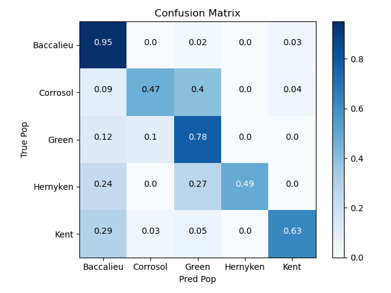

Classification report:

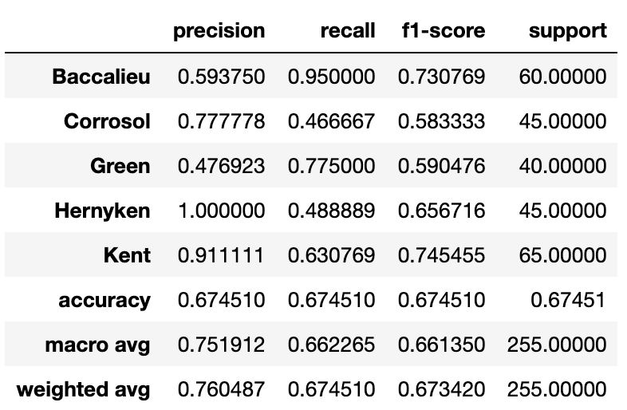

*Step 3*: run contour function on neural network output for population assignment of samples of unknown origin

The `contour_classifier` function can either take in output that has previously been generated using the program `locator` (as long as the output is located in the same folder as `save_dir`), or can run locator itself if given genetic data (just set `run_locator` argument to `True` and `gen_dat` to the path to the VCF file). This function uses 2D kernel density estimation to create contour plots from many predictions on the same sample from `locator`. It then assigns the sample to the population within the highest kernel density contour.
```
contour_classifier(
    sample_data=sample_data,
    num_contours=15,
    run_locator=True,
    gen_dat=infile_all_vcf,
    nboots=20,
    return_plots=True,
    return_df=True,
    save_dir=nn_save_path,
    multi_iter=5,
    # Key word arguments below
    train_split=0.8,
    batch_size=32,
    max_epochs=100,
    patience=100,
    min_mac=2,
    impute_missing=True,
    plot_history=True,
    keep_weights=False,
)
```

In the `save_dir` folder, you will find a `results.csv` file containing the classification for each sample, as well as the highest kernel density contour the population was found in. The kernel density estimation does not provide any indication of how well the model is performing, since the kernel density estimation depends entirely on the spread of the points.

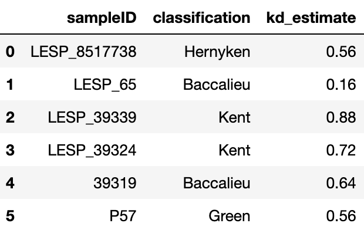

 To make sure that estimates make sense and to get an idea of the spread of your prediction values for each sample, you can set `return_plots` to `True`, and this will output all the contour plots for each unknown sample in the dataset.

 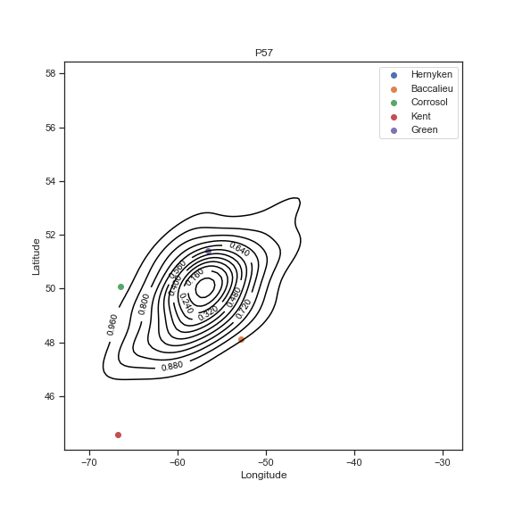

### Command Line

In addition to running within a Python IDE, you can also run `pop_finder` and `contour_classifier` on the command line!

General guidelines:

* The first two values MUST be the paths to the genetic data file (`infile`) followed by the sample data file (`sample_data`)
* You can also set all the same arguments as above using flags followed by a value
* Boolean values will be their default values unless specified by a flag (e.g. the `ensemble` parameter is `False` by default and will remain so if left out of the command line argument, but adding the `--ensemble` flag with no value following will set this value to `True`)

**Module 1**

The command line function for Module 1 is called `pop_finder_classifier`.

**Parameters**

Function flags:

* `--hyper_tune` : runs the hyperparameter tuning function
* `--kfcv` : runs K-fold cross-validation
* `--run_neural_net` : runs the neural network to predict on unknown samples
* `--snp_rank` : runs the SNP perturbation ranking function to find SNPs that are most heavily influencing model

Required parameters:

* `--infile` : path to genetic data file
* `--sample_data` : path to sample data file

Other parameters:

* `--mod_path` : path to tuned model (`save_dir` from hyper_tune)
* `--train_prop` : Proportion of data for training
* `--seed` : Random seed value
* `--save_dir` : Directory to save output to
* `--ensemble` : Use ensemble of models
* `--save_allele_counts` : Save allele counts in hdf5 file
* `--max_epochs` : Number of epochs in neural network
* `--col_scheme` : Colour scheme of structure / assign plot
* `--max_trials` : Number of trials for hyperparameter tuner
* `--runs_per_trial` : Number of runs / trial for hyperparameter tuner
* `--mod_name` : Name of project
* `--n_splits` : Number of splits for K-fold CV
* `--n_reps` : Number of repetitions for K-fold CV
* `--return_plot` : Return confusion matrix plot
* `--nbags` : Number of models if ensemble is True
* `--predict` : Predict on unknown samples
* `--save_weights` : Save model weights for later use
* `--patience` : Set model patience for early stopping
* `--batch_size` : Set batch size
* `--plot_history` : Plot training / validation history

*Step 1*: Run model hyperparameter tuner using the `--hyper_tune` flag

```
pop_finder_classifier tests/test_inputs/onlyAtl_500.recode.vcf.locator.hdf5 \
    tests/test_inputs/onlyAtl_truelocs_NAs.txt --hyper_tune \
    --max_trials 10 --runs_per_trial 10 --max_epochs 100 \
    --train_prop 0.8 --save_dir tuned_model
```

Parameters available for `--hyper_tune`:

* `--infile`
* `--sample_data`
* `--max_trials`
* `--runs_per_trial`
* `--max_epochs`
* `--train_prop`
* `--seed`
* `--save_dir`
* `--mod_name`

*Step 2*: Run K-Fold Cross-Validation using the `--kfcv` flag

* A structure plot is automatically generated and added to the output directory with the command line function
```
pop_finder_classifier tests/test_inputs/onlyAtl_500.recode.vcf.locator.hdf5 \
    tests/test_inputs/onlyAtl_truelocs_NAs.txt --kfcv \
    --mod_path tuned_model --n_splits 5 --n_reps 5 \
    --save_dir mod1_kfcv_out --patience 100 --batch_size 32 \
    --max_epochs 100
```

Parameters available for module 1 `--kfcv`:

* `--infile`
* `--sample_data`
* `--mod_path`
* `--n_splits`
* `--n_reps`
* `--ensemble`
* `--save_dir`
* `--return_plot`
* `--save_allele_counts`
* `--try_stacking`
* `--nbags`
* `--train_prop`
* `--predict`
* `--save_weights`
* `--patience`
* `--batch_size`
* `--max_epochs`
* `--gpu_number`
* `--plot_history`
* `--seed`
* `--col_scheme`

*Step 3*: Run classification neural network with the `--run_neural_net` flag

* An assign plot is automatically generated and added to the output directory with the command line function
```
pop_finder_classifier tests/test_inputs/onlyAtl_500.recode.vcf.locator.hdf5 \
    tests/test_inputs/onlyAtl_truelocs_NAs.txt --run_neural_net \
    --mod_path tuned_model --train_prop 0.8 --seed 2 \
    --save_dir mod1_nn_out --patience 100 --batch_size 32 \
    --max_epochs 100 --plot_history
```

Parameters available for `--run_neural_net`:

* `--infile`
* `--sample_data`
* `--save_allele_counts`
* `--mod_path`
* `--train_prop`
* `--seed`
* `--ensemble`
* `--try_stacking`
* `--nbags`
* `--save_dir`
* `--save_weights`
* `--patience`
* `--batch_size`
* `--max_epochs`
* `--gpu_number`
* `--plot_history`
* `--col_scheme`

*Step 4*: Run snp_rank function with the `--snp_rank` flag
```
pop_finder_classifier tests/test_inputs/onlyAtl_500.recode.vcf.locator.hdf5 \
    tests/test_inputs/onlyAtl_truelocs_NAs.txt --mod_path tuned_model \
    save_dir mod1_nn_out
```

Parameters available for `--snp_rank`:

* `--infile`
* `--sample_data`
* `--mod_path`
* `--save_dir`

**Module 2**

The command line function for Module 1 is called `pop_finder_regressor`.

**Parameters**

Function flags:

* `--contour_classifier` : Run contour_classifier function to generate predictions from `locator` output
* `--kfcv` : Run K-fold cross-validation for contour_classifier function

Required parameters:

* `--sample_data` : path to sample data

Other parameters:

* `--gen_dat` : Path to genetic data
* `--save_dir` : Output directory to save results to
* `--num_contours` : Number of contours
* `--run_locator` : Run instead of using results in save_dir
* `--nboots` : Number of bootstrap iterations
* `--return_plots` : Return plots of results
* `--return_df` : Return dataframe of results
* `--multi_iter` : Number of iterations to run
* `--n_splits` : Number of splits for K-Fold CV
* `--n_runs` : Number of repetitions for K-Fold CV
* `--return_plot` : Return confusion matrix
* `--train_split` : Proportion of data for training
* `--jacknife` : Run jacknife on locator
* `--jacknife_prop` : Proportion for jacknife
* `--batch_size` : Batch size for model
* `--max_epochs` : Number of epochs to run model
* `--patience` : Patience of model for early stopping
* `--min_mac` : Minimum minor allele count
* `--max_SNPs` : Maximum number of SNPs to use
* `--impute_missing` : Impute missing data
* `--dropout_prop` : Dropout proportion
* `--nlayers` : Number of layers in network
* `--width` : Width or number of nodes per layer
* `--seed` : Random seed for locator
* `--gpu_number` : GPU number (coming soon...)
* `--plot_history` : Plot training / validation history
* `--keep_weights` : Save weights for future
* `--load_params` : Path to json params file with model args
* `--keras_verbose` : How verbose keras output is, from 0-2

* The path to the sample data file (`sample_data`) is a non-optional argument and must be first in the command line function

*Step 1*: run K-Fold Cross-Validation by setting the `--kfcv` flag
```
pop_finder_regressor tests/test_inputs/onlyAtl_truelocs_NAs.txt \
    --gen_dat tests/test_inputs/onlyAtl_500_kfcv.recode.vcf \
    --kfcv --n_splits 5 --n_runs 5 --return_plot \
    --save_dir mod2_kfcv_out --num_contours 15 --nboots 20 \
    --batch_size 32 --max_epochs 100 --patience 100 --min_mac 2 \
    --impute_missing --plot_history
```

Parameters available for module 2 `--kfcv`:

* `--sample_data`
* `--gen_dat`
* `--n_splits`
* `--n_runs`
* `--return_plot`
* `--num_contours`
* `--nboots`
* `--save_dir`
* `--multi_iter`
* `--train_split`
* `--jacknife`
* `--jacknife_prop`
* `--batch_size`
* `--max_epochs`
* `--patience`
* `--min_mac`
* `--max_SNPs`
* `--impute_missing`
* `--dropout_prop`
* `--nlayers`
* `--width`
* `--seed`
* `--plot_history`
* `--keep_weights`
* `--load_params`
* `--keras_verbose`

*Step 2*: run neural networks and contour classifier by setting the `--contour_classifier` flag
```
pop_finder_regressor tests/test_inputs/onlyAtl_truelocs_NAs.txt \
    --gen_dat tests/test_inputs/onlyAtl_500.recode.vcf \
    --contour_classifier --num_contours 15 --run_locator \
    --nboots 20 --save_dir mod2_nn_out --multi_iter 3 \
    --train_split 0.8 --batch_size 32 --max_epochs 100 \
    --patience 100 --min_mac 2 --impute_missing --plot_history
```

Parameters available for `--contour_classifier`:

* `--sample_data`
* `--num_contours`
* `--run_locator`
* `--gen_dat`
* `--nboots`
* `--return_plots`
* `--return_df`
* `--save_dir`
* `--multi_iter`
* `--train_split`
* `--jacknife`
* `--jacknife_prop`
* `--batch_size`
* `--max_epochs`
* `--patience`
* `--min_mac`
* `--max_SNPs`
* `--impute_missing`
* `--dropout_prop`
* `--nlayers`
* `--width`
* `--seed`
* `--plot_history`
* `--keep_weights`
* `--load_params`
* `--keras_verbose`

## Documentation

The official documentation is hosted on Read the Docs: https://pop_finder.readthedocs.io/en/latest/

## Contributors

We welcome and recognize all contributions. You can see a list of current contributors in the [contributors tab](https://github.com/katieb1/pop_finder/graphs/contributors).

### Credits

This package was created with Cookiecutter and the UBC-MDS/cookiecutter-ubc-mds project template, modified from the [pyOpenSci/cookiecutter-pyopensci](https://github.com/pyOpenSci/cookiecutter-pyopensci) project template and the [audreyr/cookiecutter-pypackage](https://github.com/audreyr/cookiecutter-pypackage).

The original `locator` code for this package was created by [Battey et al. 2020](https://elifesciences.org/articles/54507) and can be found in this [GitHub repository](https://github.com/kr-colab/locator).
